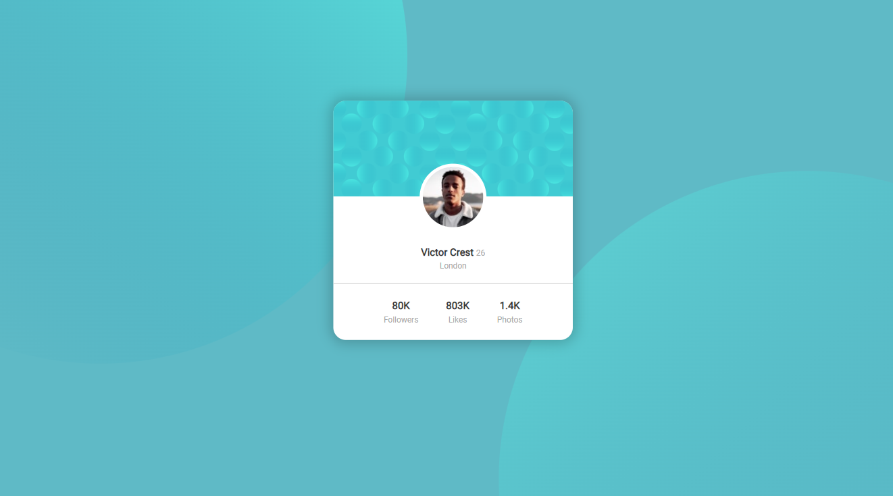
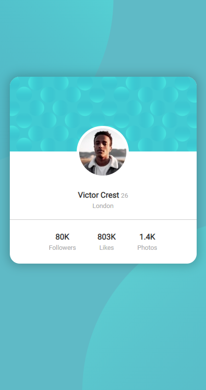

# Frontend Mentor - Profile card

[Live site](https://determined-shannon-b84668.netlify.app/)

In this small project I will recreate a profile component using simple html and basic css.

## Known Issues

- ~~Any resolution below 1440px wide shrinks the page~~. [Fixed]
- ~~Related to the point above, there's no mobile site~~. [Fixed]

## Updates
- Added mobile site/made the page responsive.

## References
[Frontend Mentor](https://www.frontendmentor.io/)

[My other solutions](https://www.frontendmentor.io/profile/CarlosDRA)

## Contact
Carlos Daniel Regalado Aguirre

[github](https://www.github.com/CarlosDRA)

[Frontend Mentor](https://www.frontendmentor.io/profile/CarlosDRA)

Email: **cd.regaladoaguirre@hotmail.com**
